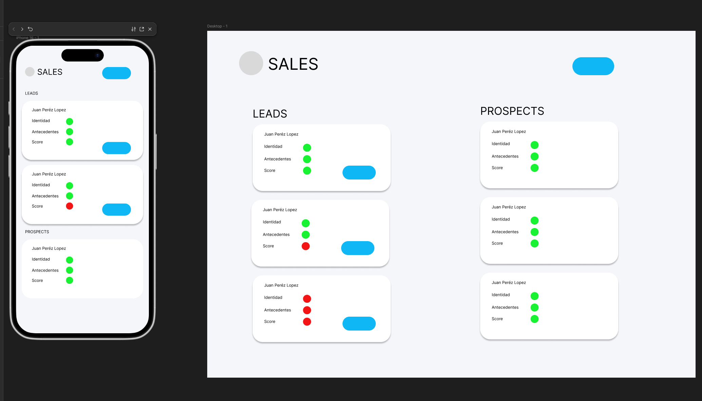
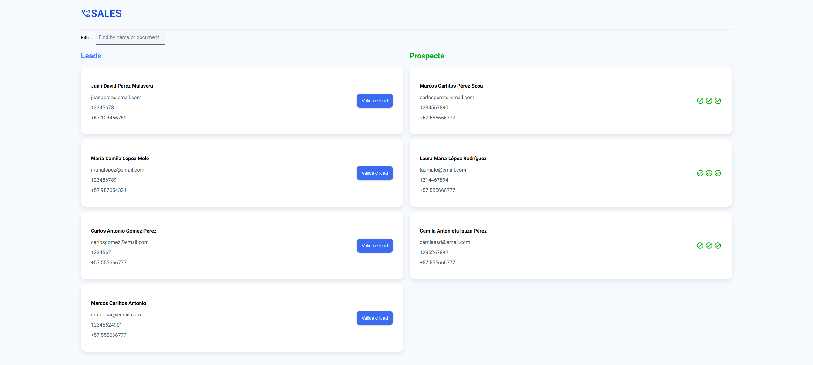
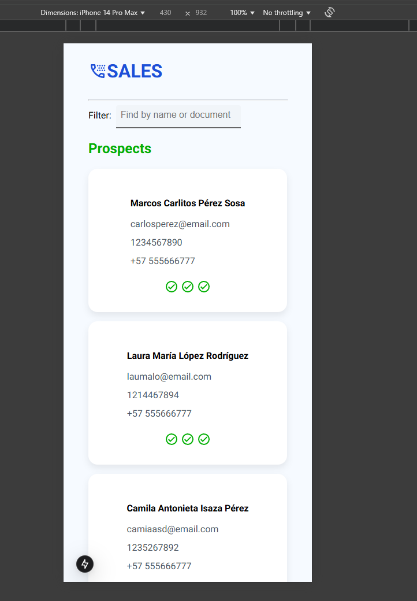

# Sales-CRM-ADDI

Frontend Software Engineer -
Technical Challenge

# Initial Design and Approach

The goal is to create a CRM sales system that allows managing the company's Leads and Prospects while enabling the team to perform automatic validations so that a Lead can transition into a Prospect.

With this in mind, the primary focus is to develop a simple application that allows users to execute functionalities quickly and easily, without adding unnecessary features.

Considering the mobile-first approach, the following basic design was proposed:

A card displaying relevant information about Leads and Prospects.
An option to automatically validate Leads, allowing them to transition into the Prospect category.
A list displaying the validated Prospects.

The first step in development is to build a basic React with Next.js application for the project. The goal is to apply atomicity and OOP principles, along with composition patterns used in React, which will enable easy scalability of the project in the future.

Additionally, the objective is to develop a reactive application using HTML and CSS, ensuring a simple yet functional and minimalistic UI, which is common in enterprise-level projects such as a CRM.

# Relevant Frameworks and Libraries:

Next.js
Personal preference.

Jest
Personal preference and good compatibility with Next.js.

Styled Components
Styled Components were chosen because of the preference for semantic HTML, which improves readability and maintainability. This ensures that code blocks accurately represent what the HTML does, making it much more understandable and manageable.

React Query
Used for simulating web requests and ensuring proper logic functionality behind validations.

# Estructura del proyecto: 

/src/app
├── _data/         # Basic simulation of a database using a JSON file
├── (landing)/     # Fake route simulation for better organization
├── _components/   # Reusable elements within the code
├── atoms/         # Basic reusable elements
├── hooks/         # Logic and validation functionality
├── icons/         # SVG icons converted to JSX
├── molecules/     # Components composed of "atoms"
├── providers/     # Context for managing Leads and Prospects
├── page.tsx       # HTML skeleton and use of "molecules" on the page
├── types/         # Reusable interfaces

# Installation and Execution

1.  Clone the repository
git clone https://github.com/Steven-Rodriguez-git/Sales-CRM-ADDI.git
cd CRM ADDI SALES

2.
npm install

3./// Run the application
npm run dev

4./// Run tests
npm test 

# Features and Implementation

- Leads and Prospects are displayed correctly in the application.
- The most relevant information about Leads and Prospects is shown in a clear and summarized manner.
- A validation button was added to automatically verify whether Leads meet the requirements to become Prospects.
    - Parallel validation of registration and identity is performed.
    - Randomized score validation occurs if the first two validations are successful; otherwise, it fails immediately.
    - If all three validations are successful, the Lead transitions to the Prospect section.
- A search functionality was added as an essential feature for this type of application.

# UI, UX, and Design Decisions

- A structured UI was chosen, placing the Leads section on the left and the Prospects section on the right, aligning with user expectations—since a Prospect represents an advanced Lead.

- In the mobile version, Prospects are displayed first, assuming that they will likely be fewer in number and the primary focus of the application. This improves accessibility on smaller devices.

- Cards were used to create a modern and user-friendly interface, removing unnecessary information. Hover effects and shadows were implemented to enhance the user experience visually.

- Buttons were introduced as interactive elements, allowing users to automate the process. Additional feedback mechanisms were included to enhance user experience when interacting with buttons.

- Three different validation states were implemented to help users understand the validation process:

    - Gray state with a loading icon.
    - Green state with a checkmark icon for successful validation.
    - Red state with an error icon for failed validations.
- A tooltip on hover provides further clarification on failed or successful validations.
- A filter was added at the top of the page to improve user experience, especially when searching for a specific Lead or managing a large number of Leads.

- Additional design decisions included using a clear and uniform typography, proper padding and margins, and ensuring a spaced-out, visually accessible UI that presents information in a clear and straightforward manner.

- The application was designed to be minimalistic and user-friendly, avoiding unnecessary elements, cluttered content, or extra features that do not contribute to the application's core functionality.

/// Diseño final aplicación de escritorio

/// Diseño final aplicación movil

# Test

npm test

- Test coverage includes:
    - Data validation.
    - State management and changes.
    - Rendering of the most relevant elements.

# Possible Improvements and Enhancements

- Tabs in the mobile version to improve navigation between Leads and Prospects.
- If applicable, allow users to delete, archive, or add Leads. If not, implement automatic archiving for failed Leads.
- More extensive testing to achieve full coverage.
